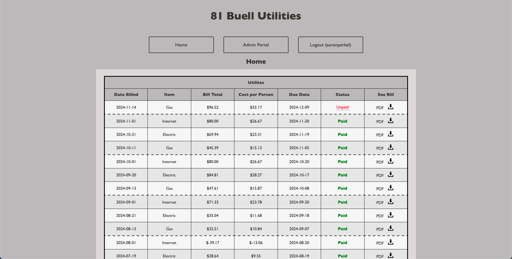

# Utility Manager

## Description
Utility Manager is a web application designed to help roommates manage and track their shared utility bills. It provides a user-friendly portal where bills are displayed in a table format, showing details such as bill date, due date, cost per person, status, and links to view or download PDFs of the bills.

The application is built using HTML, CSS, PHP, SQL, and Python. It includes an admin portal for adding new bills, updating bill statuses, and sending email reminders. Automated emails are sent when new bills are uploaded or when due dates are approaching, helping everyone stay on top of their payments.

## Features
- Bill Tracking: View a table of all utility bills with detailed information.
- User Authentication: Secure login system with role-based access control.
- Admin Portal: Administrators can add new bills, update statuses, and send reminders.
- Automated Emails: Automatic email notifications for new bills and upcoming due dates.
- Calendar Integration: Downloadable `.ics` files to add due dates to personal calendars

## Demo


## Requirements
### Server Requirements
- Web Server: Apache or Nginx
- PHP: Version 7.2.5 or higher
    - Extensions:
        - PDO extension for MySQL
        - OpenSSL
        - `mbstring`
        - `ctype`
        - `json`
- MySQL: Compatible with PHP’s PDO extension
- Composer: For managing PHP dependencies

### Python Requirements
- Python: Version 3.x
- Python Packages:
    - `sqlalchemy`
    - `schedule`
    - `python-dotenv`

### Other Requirements
- SMTP Server: Access to an SMTP server for sending emails
- Environment Variables: Configuration via a .env file

## Setup Instructions
### 1. Clone the Repository
```bash
git clone https://github.com/aaronperkel/utility-manager.git
cd utility-manager
``` 

### 2. Install PHP Depenencies
Make sure you have Composer installed. Install the PHP dependencies by running:
```bash
composer install
```
### 3. Set Up Environment Variables
Create a `.env` file inside the `config/ `directory with the following content:
```dotenv
DBNAME=your_database_name
DBUSER=your_database_username
DBPASS=your_database_password
EMAIL_PASS="your_email_password"
```
Replace the placeholder values with your actual database credentials and email password.

### 4. Set Up the Database
- Create a MySQL Database: Use your preferred method to create a new database for the application.
- Import Database Schema: You can find the SQL statements for creating the necessary tables in `app/sql.php`. Here’s an example:
```sql
CREATE TABLE tblUtilities (
  pmkBillID INT NOT NULL AUTO_INCREMENT PRIMARY KEY,
  fldDate VARCHAR(50) DEFAULT NULL,
  fldItem VARCHAR(50) DEFAULT NULL,
  fldTotal VARCHAR(50) DEFAULT NULL,
  fldCost VARCHAR(50) DEFAULT NULL,
  fldDue VARCHAR(50) DEFAULT NULL,
  fldStatus VARCHAR(50) DEFAULT NULL,
  fldView VARCHAR(150) DEFAULT NULL,
  fldOwe VARCHAR(150) DEFAULT NULL
);
```
- Insert Initial Data: If needed, insert initial records into the database.

### 5. Configure the Web Server
Ensure your web server is set up to serve the application correctly:
- Document Root: Point the document root to the `public/` directory of the project.
- URL Rewriting: If using Apache, make sure .htaccess files are enabled to handle URL rewriting if necessary.
- Permissions: Ensure the web server has the necessary permissions to read the files.

### 6. Install Python Dependencies
Install the required Python packages using `pip`:
```bash
pip install sqlalchemy schedule python-dotenv
```

### 7. Configure Email Settings
Update the email configurations in the Python scripts located in the `scripts/` directory:
- SMTP Server Details: Modify the SMTP server settings in `db.py` and other relevant scripts.
- Sender Email and Password: Update `sender_email` and ensure` EMAIL_PASS` is correctly set in your `.env` file.

Example snippet from db.py:
```python
sender_email = 'your_email@example.com'
sender = 'your_email_alias@example.com'
sender_password = os.getenv('EMAIL_PASS')
```

### 8. Set Up Automated Tasks
To enable automated email notifications:
- Nohup Job: Set up a nohup job to run the `run.py` script.
```bash
nohup python -u run.py &
```

## Usage
- User Access: Regular users can view bills, see their payment status, and download bill PDFs.
- Admin Access: Admin users have additional privileges, such as adding new bills and updating payment statuses.
- Payment Tracking: Easily track who has paid and who still owes money.
- Reminders: Automatic email reminders help ensure timely payments.

## Contributing
This is a personal project, but if you’d like to contribute:
1.	Fork the repository.
2.	Create a new branch for your feature or bug fix.
3.	Submit a pull request with a detailed description of your changes.

## License
This project is licensed under the MIT License. See the [LICENSE](LICENSE.md) file for details.