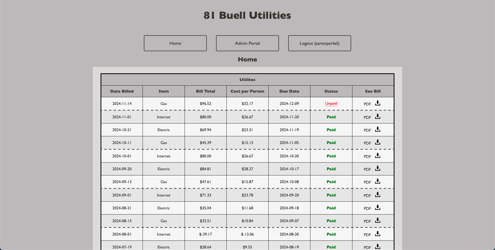

# Utility Manager

## Description
This is a personal project of mine that is still under development. It is a portal for my two roommates' and my utility bills. It displays a table of our bills, along with the bill date, the due date, the cost per person, the status of the bill, and has links to download or view the PDF. It is built using HTML, CSS, PHP, SQL, and Python. There is an admin portal where I can add new bills, change the status of bills, or send an email reminder that a bill is coming up. A Raspberry Pi automatically sends emails to us when there are 5 days until the due date if the bill is not paid. We also get emails when new bills are uploaded to the site.

### Website Demo



### Requirements
1. Python Libraries
    1. `sqlalchemy`
    2. `schedule`
    3. `python-dotenv`
2. `.htaccess`
3. `.env`

### Setup Instructions
I have the following inside of my `.htaccess` file:

```
RewriteEngine on

RewriteCond %{THE_REQUEST} /([^.]+)\.php [NC]
RewriteCond %{REQUEST_URI} !/update_status_paid\.php [NC]
RewriteCond %{REQUEST_URI} !/update_status_unpaid\.php [NC]
RewriteCond %{REQUEST_URI} !/send_reminder\.php [NC]
RewriteRule ^ /%1 [NC,L,R]

RewriteCond %{REQUEST_FILENAME}.php -f
RewriteCond %{REQUEST_URI} !/update_status_paid\.php [NC]
RewriteCond %{REQUEST_URI} !/update_status_unpaid\.php [NC]
RewriteCond %{REQUEST_URI} !/send_reminder\.php [NC]
RewriteRule ^ %{REQUEST_URI}.php [NC,L]
```

This is so that the web url does not end in `.php`. I also have the following environemnt variables in `.env`:

```
DBNAME=name
DBUSER=username
DBPASS=password
EMAIL_PASS="xxxx xxxx xxxx xxxx"
```
